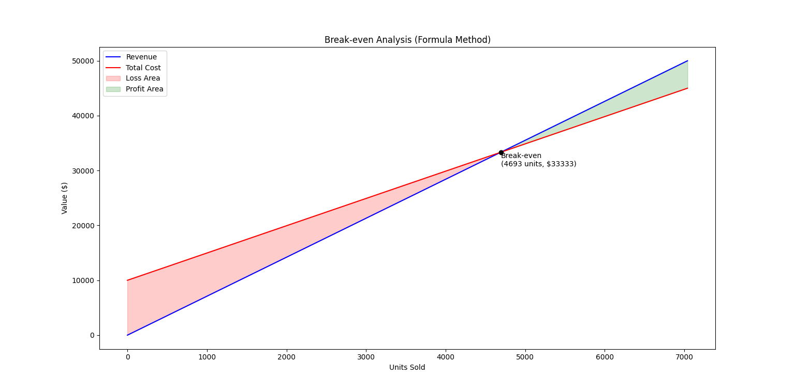

# 🎯 Goals & Overview

**Dataset Source:**
Restaurant Sales Data from Kaggle — daily transactional data across locations and channels.
Link: [Restaurant Sales Dataset](https://www.kaggle.com/datasets/rohitgrewal/restaurant-sales-data)

---

## 1. Profitability Analysis / Break-even

* Calculate revenue and cost under a profit margin assumption.
* Estimate the number of units needed to break even in a given timeframe.

## 2. Exploratory Data Analysis (EDA)

* Identify the most preferred **payment method**.
* Determine **top-selling products** by quantity and by revenue.
* Find which **city or manager** yields the highest revenue.
* Explore **revenue trends** over time, especially November–December.
* Compute summary statistics: averages, variance, standard deviation.
* Assess whether revenue is **increasing or decreasing** over time.
* Compare **performance metrics per product** (avg. quantity sold, avg. revenue).

## 3. Time Series Forecasting & Model Comparison

* Apply transformations (e.g., log) to stabilize variance.
* Fit and compare models: **ARIMA, SARIMA, ETS**.
* Use **time-series cross-validation** for robust evaluation.
* Select the **best model** based on error metrics.
* Forecast **future revenue** (e.g., next 5–10 days).
* Visualize **model predictions vs actuals** across subplots.

---

# 📊 Results

## 1. Break-even Analysis

* **Break-even Units (computed):** 4,693
* **Break-even Revenue (computed):** $33,333
* By the **third day** (November 9, 2022), the restaurant had already sold **5,270 units**, reaching break-even.
* This figure is **slightly above the computed break-even threshold**, providing a margin of safety.
* The result highlights strong **initial demand**, allowing the restaurant to cover costs earlier than projected.

---

## 2. Exploratory Data Analysis (EDA) & Trends

The restaurant’s performance across the 254-day period reveals key insights:

* **Payment Behavior**
  Over **120 out of 254 transactions** were completed using **credit cards**, showing that digital payment methods are central to customer purchasing behavior.

* **Top Products by Quantity**

  * 🥤 Beverages → 34,983.14 units
  * 🍟 Fries → 32,034.34 units
  * 🍔 Burgers → 29,022.31 units
  * 🍗 Chicken Sandwiches → 11,135.92 units
  * 🥗 Sides & Other → 9,819.60 units

  Beverages and fries dominate in volume, while burgers remain a core menu driver.

* **Top Products by Revenue**
  Burgers clearly lead revenue generation:

  * Burgers → $376,999.81
  * Fries → $125,674.29
  * Chicken Sandwiches → $114,641.70
  * Beverages → $103,200.26
  * Sides & Other → $48,999.80

  **Insight:** Burgers, despite being less frequent than beverages, provide **higher margins** and drive overall profitability.

* **City-Level Performance**

  * 🏆 Lisbon — $241,714.12 (Joao Silva)
  * London — $211,201.04 (Tom Jackson)
  * Madrid — $136,200.27 (Pablo Perez)
  * Berlin — $100,600.13 (Walter Muller)
  * Paris — $79,800.31 (Remy Monet)

  Lisbon and London emerge as the strongest markets.

* **Revenue Trends**

  * Average daily revenue: **$3,029.59**
  * **December** outperformed **November**, generating **$437,401.20 vs $332,114.66** (+$105,286.54).
  * Seasonal sales likely boosted December performance.

* **Variability & Spread**

  * Std. Dev. (Revenue): **$2,415.35**
  * Std. Dev. (Quantity): **214.47**
  * Variances confirm noticeable fluctuations, particularly around December peaks.

* **Average Sales per Product (per day)**

  * Burgers → **$7,249.99**
  * Fries → **$2,464.20**
  * Beverages → **$2,064.01**

📈 **Visualization:**

---

## 3. Time Series Analysis

Three models—**ARIMA, SARIMA, and ETS**—were tested to forecast daily revenue.

The forecasts show a **straight-line projection**, reflecting the underlying **stable and stagnant revenue trend** in the data.

* A small **spike in mid-November** hints at occasional surges, possibly due to promotions.
* Noticeable **dips around November 20 and December 5** suggest short-term demand fluctuations.
* Beyond these, daily revenue remained **steady**, leading models to project flat forecasts.

📌 **Interpretation:** Stability here is positive. As a relatively new restaurant, the absence of sharp volatility shows operational consistency. With more time and data, stronger seasonal or structural patterns may emerge.

---

### 📊 Model Performance (Cross-Validation)

| Model  | MAE   | RMSE  | MAPE (%) | SMAPE (%) | Bias   | R²    |
| ------ | ----- | ----- | -------- | --------- | ------ | ----- |
| SARIMA | 0.148 | 0.171 | 1.54     | 1.55      | -0.120 | -1.96 |
| ARIMA  | 0.125 | 0.143 | 1.30     | 1.31      | -0.109 | -1.07 |
| ETS    | 0.092 | 0.114 | 0.96     | 0.97      | -0.076 | -0.32 |

✅ **ETS delivered the lowest error values across all metrics**, outperforming ARIMA and SARIMA.
⚠️ The negative R² values reflect the limited variance explained by any model—expected given the near-flat trend.

---

# 📝 Conclusion

The analysis paints a clear picture of the restaurant’s performance:

* **Profitability was achieved quickly**, with break-even reached by Day 3.
* **Beverages dominate in volume**, but **burgers are the primary profit driver**.
* **Lisbon and London** lead in revenue, marking them as strategic markets.
* **December sales surged**, likely from holiday effects, while November was relatively weaker.
* From a forecasting perspective, **ETS performed best**, though the flat revenue pattern limited predictive power.

Overall, the business demonstrates **early operational stability** with signs of growth potential in key cities. As more months of data accumulate, time series modeling will reveal **seasonality and demand patterns**, guiding better inventory planning, promotional timing, and strategic expansion.

---

